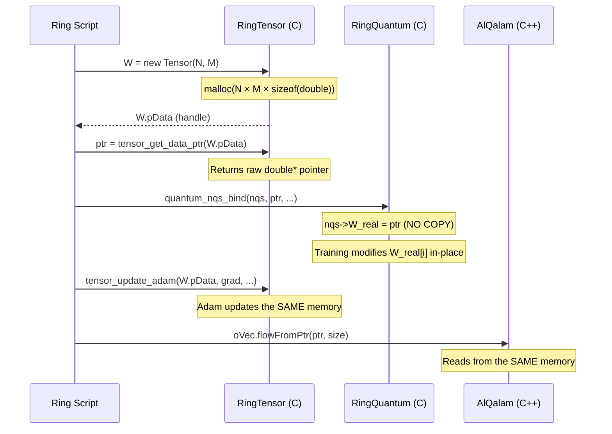
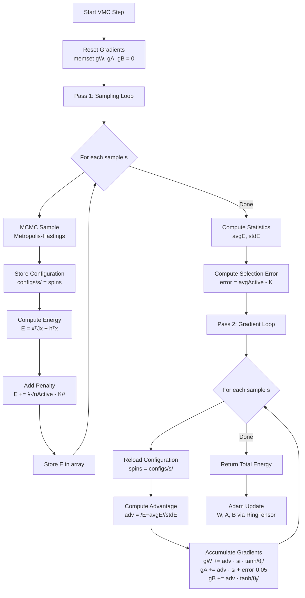
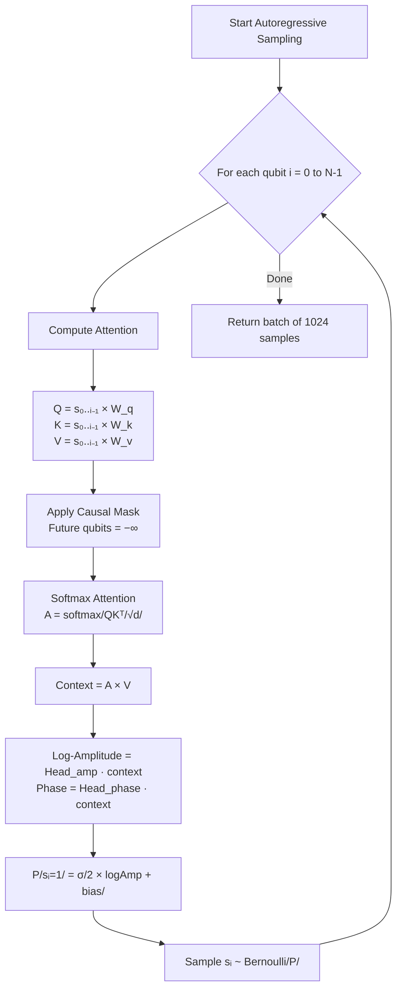
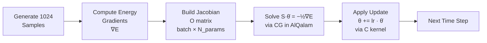
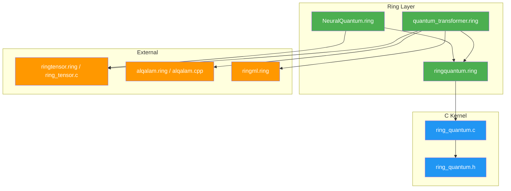

# 🏗️ RingQuantum — Architecture Documentation

## System Overview

RingQuantum is built as a **three-layer architecture** where each layer handles a specific concern:

```
┌──────────────────────────────────────────────────────────────┐
│                     Ring Application Layer                    │
│                                                              │
│  QuantumCircuit     NeuralQuantum     QuantumTransformer     │
│  (ringquantum.ring) (NeuralQuantum.ring) (quantum_transformer.ring)   │
│                                                              │
│  Pure Ring classes providing a clean, object-oriented API    │
├──────────────────────────────────────────────────────────────┤
│                      C Kernel Layer                          │
│                                                              │
│  ring_quantum.c (~95KB)                                      │
│  ┌────────────┬────────────────┬──────────────────────┐      │
│  │ Statevector│  NQS/RBM       │  Transformer/ANQS    │      │
│  │ Engine     │  Engine         │  Engine              │      │
│  │            │                 │                      │      │
│  │ • Gates    │ • MCMC Sampler  │ • Autoregressive     │      │
│  │ • Measure  │ • VMC Step      │   Sampling           │      │
│  │ • QFT      │ • Local Energy  │ • VMC Step           │      │
│  │ • ExpZ     │ • Gradients     │ • Jacobian           │      │
│  │            │ • Hybrid Grad   │ • Apply Update       │      │
│  └────────────┴────────────────┴──────────────────────┘      │
│                                                              │
│  OpenMP (CPU) │ OpenCL (GPU) │ XorShift (Thread-Safe RNG)    │
├──────────────────────────────────────────────────────────────┤
│                  External Dependencies                        │
│                                                              │
│  RingTensor (C)        │  AlQalam (C++)      │  RingML       │
│  • tensor_init         │  • QalamVector      │  • Adam class │
│  • tensor_update_adam  │  • QalamSolver (CG) │               │
│  • tensor_get_data_ptr │  • QalamChronos     │               │
│  • GPU acceleration    │  • Formula Engine   │               │
└──────────────────────────────────────────────────────────────┘
```

---

## Data Structures

### 1. `quantum_t` — Statevector State

```c
typedef struct {
    float *data;          // Interleaved [Re₀, Im₀, Re₁, Im₁, ...]
    size_t size;          // 2^n complex amplitudes
    int nqubits;
    int is_owner;         // Memory ownership flag
    cl_mem gpu_buffer;    // OpenCL GPU buffer
    cl_mem res_buffer;    // Temp buffer for ExpZ results
} quantum_t;
```

**Memory Layout:**
```
Index:  0    1    2    3    4    5    6    7    ...
Data:  Re₀  Im₀  Re₁  Im₁  Re₂  Im₂  Re₃  Im₃  ...
State: |000⟩     |001⟩     |010⟩     |011⟩
```

### 2. `nqs_t` — Neural Quantum State (RBM)

```c
typedef struct {
    int nqubits;          // N — number of visible neurons (assets)
    int nhidden;          // M — number of hidden neurons

    // Learnable Parameters (Zero-Copy with RingTensor)
    double *W_real;       // [N × M] Weight matrix (real)
    double *W_imag;       // [N × M] Weight matrix (imaginary)
    double *a_real;       // [N] Visible biases
    double *b_real;       // [M] Hidden biases

    // State
    int8_t *spins;        // [N] Current spin configuration {-1, +1}

    // Cache (Speed Optimization)
    double *theta_re;     // [M] Pre-computed activations (real)
    double *theta_im;     // [M] Pre-computed activations (imag)

    // OpenCL Buffers (GPU Acceleration)
    cl_mem cl_W_re, cl_W_im, cl_b_re, cl_spins;
    cl_mem cl_h, cl_J, cl_t_re, cl_t_im, cl_res;

    // Float Caches (FP32 GPU Transfer)
    float *h_f, *J_f, *s_f, *w_re_f, ...;
} nqs_t;
```

### 3. `anqs_t` — Autoregressive Transformer

```c
typedef struct {
    int nqubits;          // N — system size
    int nheads;           // Number of attention heads
    int ndim;             // D — attention dimension
    int batch_size;       // Parallel samples (e.g., 1024)

    // Complex Attention Weights (Zero-Copy with RingTensor)
    double *W_q_re, *W_q_im;     // [N × D] Query
    double *W_k_re, *W_k_im;     // [N × D] Key
    double *W_v_re, *W_v_im;     // [N × D] Value
    double *Head_amp_W;           // [D] Amplitude head
    double *Head_phase_W;         // [D] Phase head

    // Batch State
    int8_t *spins;                // [batch_size × N]

    // Per-Qubit Learnable Bias (Direct SGD)
    double *logit_bias;           // [N]

    // OpenCL & Float Caches
    cl_mem cl_W_q_re, cl_W_q_im, ...;
    float *wq_re_f, *wk_re_f, ...;
} anqs_t;
```

---

## Zero-Copy Memory Pipeline

The critical innovation is **shared pointer ownership** between Ring, C, and C++ layers:



**Result:** The weight matrix is allocated **once** by RingTensor and shared across all three engines with zero memory copies.

---

## VMC Training Pipeline (RBM)



---

## Transformer Sampling Pipeline



---

## TDVP Natural Gradient Pipeline



Where:
- **S** = Oᵀ·O / batch − ⟨O⟩ᵀ·⟨O⟩ (Quantum Fisher Information Matrix)
- **∇E** = Force vector (energy gradients)
- **θ̇** = Natural gradient (solution of the linear system)

---

## File Dependencies



---

## OpenCL GPU Kernel Architecture

```
┌─────────────────────────────────────────┐
│           GPU Kernel Dispatch           │
├─────────────────────────────────────────┤
│                                         │
│  if (nqubits > threshold && gpu_ready)  │
│    → OpenCL Kernel (FP32)               │
│  else                                   │
│    → OpenMP Kernel (FP64)               │
│                                         │
├─────────────────────────────────────────┤
│  Available GPU Kernels:                 │
│                                         │
│  • gate_h_kernel     — Hadamard         │
│  • gate_x_kernel     — Pauli-X          │
│  • gate_cnot_kernel  — CNOT             │
│  • gate_phase_kernel — Phase rotation   │
│  • nqs_energy_kernel — Local energy     │
│  • anqs_sample_kernel — AR sampling     │
│                                         │
│  Memory: CL_MEM_ALLOC_HOST_PTR          │
│  Precision: FP32 (Intel Optimized)      │
│  Transfer: Zero-Copy (Mapped Buffers)   │
└─────────────────────────────────────────┘
```

---

## Thread Safety Model

| Component | Strategy | Details |
|:----------|:---------|:--------|
| Gate Operations | OpenMP `parallel for` | Safe — independent state indices |
| MCMC Sampling | Sequential per sample | Thread-safe within VMC step |
| Energy Calculation | OpenMP `reduction(+:energy)` | Atomic accumulation |
| Gradient Accumulation | OpenMP `reduction` | Per-sample independence |
| Random Numbers | Thread-local XorShift | No locks, no contention |
| Weight Updates | External (RingTensor Adam) | Sequential, after VMC step |

---

<div align="center">

**RingQuantum Architecture Documentation**  
Version 5.0 — April 2026

</div>
