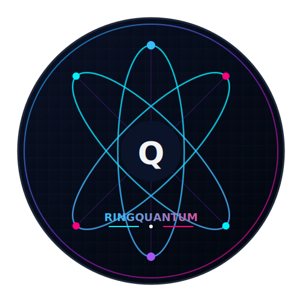
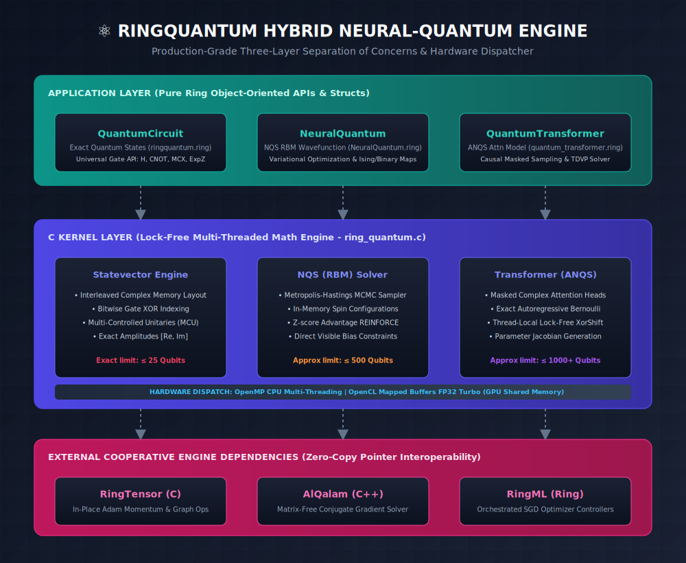
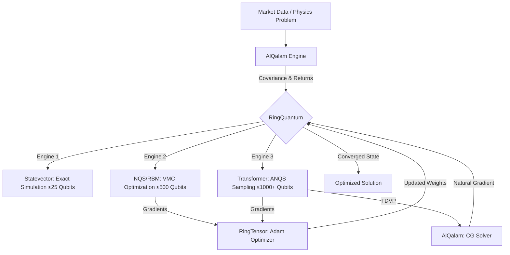

# ⚛️ RingQuantum - Hybrid Neural-Quantum Simulation Engine for Ring

<div align="center">




**A production-grade quantum computing simulator with Neural Quantum States, GPU acceleration, and real-time dynamics**

[Features](#-key-features) • [Installation](#-installation) • [Quick Start](#-quick-start) • [Architecture](#-three-engine-architecture) • [API Reference](#-api-reference) • [Examples](#-examples) • [Performance](#-performance)

</div>

---

## 📖 Overview

**RingQuantum** is a high-performance C extension for the Ring programming language that bridges quantum physics and artificial intelligence. It provides three distinct simulation engines unified under a single Zero-Copy architecture:

- ⚛️ **Statevector Simulator**: Exact quantum circuit simulation for up to 25 qubits
- 🧠 **Neural Quantum States (NQS/RBM)**: Variational Monte Carlo for 500+ qubit optimization
- 🤖 **Quantum Transformer (ANQS)**: Autoregressive neural sampling for 1000+ qubit systems

### What Makes It Unique

RingQuantum is designed to solve **real-world optimization problems** (portfolio selection, protein folding, combinatorial optimization) on commodity hardware. By synthesizing Deep Learning, Quantum Physics, and Zero-Copy System Engineering, an Intel i3 laptop can search through **10¹⁵⁰ quantum states** — a task that would require a supercomputer with classical methods.

---

## ✨ Key Features

### ⚛️ Exact Quantum Simulation
- **Full Gate Set**: H, X, Y, Z, CNOT, Swap, Toffoli, Rx, Ry, Rz, U-Gate
- **Multi-Controlled Gates**: MCX and MCU for arbitrary control qubits
- **Measurement**: Single-qubit measurement, probabilities, expectation values
- **Algorithms**: QFT, IQFT, Grover's Search, VQE, Phase Estimation

### 🧠 Neural Quantum States (RBM)
- **Restricted Boltzmann Machine** wavefunction ansatz
- **Metropolis-Hastings MCMC** sampler with Delta Updates
- **Centered VMC Gradients** with Advantage Normalization (Z-score)
- **Hybrid Gradient Engine**: REINFORCE + Analytical Constraint Gradient
- **Binary Portfolio Mapping**: Optimized for {0,1} asset selection

### 🤖 Autoregressive Quantum Transformer (ANQS)
- **Causal Masked Attention** with Complex-Valued Heads
- **Exact Sampling**: No Markov-chain autocorrelation
- **Per-Qubit Logit Bias**: Direct SGD for constraint satisfaction
- **Batch Parallel Sampling**: 1024 parallel universes per step

### 🚀 TDVP Dynamics Engine (v5.0)
- **Time-Dependent Variational Principle** for quantum natural gradient
- **Matrix-Free Conjugate Gradient** solver (via AlQalam)
- **Jacobian Matrix** computation for batch samples
- **Adaptive Constraint Annealing**: Dynamic penalty scheduling

### ⚡ Performance Architecture
- **Zero-Copy Memory**: Shared physical RAM between CPU (Ring) and GPU (OpenCL)
- **FP32 Turbo Mode**: Optimized for Intel integrated GPUs
- **OpenMP Parallelism**: Multi-threaded kernels for all operations
- **Lock-Free XorShift RNG**: Thread-local random number generation
- **Fused VMC Kernel**: Entire optimization loop in a single C call

---

## 📦 Installation

### Option 1: Using RingPM (Recommended)

```bash
ringpm install ringquantum from Azzeddine2017
```

### Option 2: Manual Installation

1. **Clone the repository**:
   ```bash
   git clone https://github.com/Azzeddine2017/ringquantum.git
   cd ringquantum
   ```

2. **Build the extension** (see [Build Instructions](#-build-instructions))

3. **Install to Ring directory**:
   ```bash
   ring setup.ring
   ```

---

## 🛠️ Build Instructions

### Prerequisites

**All Platforms:**
- Ring Language 1.25 or higher
- C Compiler with C99 support

**Required Extensions:**
- [RingTensor](../ringtensor) — Tensor operations and Adam optimizer
- [AlQalam](../AlQalam) — Vector engine and CG solver

**Optional (for GPU support):**
- OpenCL SDK (Intel, NVIDIA, or AMD)

**Optional (for multi-threading):**
- OpenMP support (included in most modern compilers)

### Windows (Visual Studio / MSVC)

```bat
cd extensions\ringquantum
buildvc.bat
```

#### Manual Build

```bat
cls
call ..\..\language\build\locatevc.bat x64

cl /c /O2 /Ot /GL /MD /openmp /DUSE_OPENCL ring_quantum.c ^
   -I"..\..\language\include" -I"./include"

link /LTCG /DLL ring_quantum.obj lib\OpenCL.lib ^
     ..\..\lib\ring.lib kernel32.lib ^
     /OUT:..\..\bin\ring_quantum.dll

del ring_quantum.obj
```

**Compiler Flags Explained:**
- `/O2 /Ot`: Maximum speed optimization
- `/GL`: Whole program optimization
- `/MD`: Multi-threaded DLL runtime
- `/openmp`: Enable OpenMP parallelization
- `/DUSE_OPENCL`: Enable GPU support

### Linux (GCC)

```bash
cd extensions/ringquantum
chmod +x buildgcc.sh
./buildgcc.sh
```

#### Manual Build

```bash
gcc -shared -o libring_quantum.so -O3 -fPIC -fopenmp -DUSE_OPENCL \
    ring_quantum.c \
    -I ../../language/include \
    -L ../../lib -lring -lOpenCL -lm
```

### macOS (Clang)

```bash
cd extensions/ringquantum
chmod +x buildclang.sh
./buildclang.sh
```

#### Without GPU Support

Remove `-DUSE_OPENCL` and the OpenCL library from the link command on any platform.

### Build Verification

```ring
load "ringquantum.ring"

q = new QuantumCircuit(5)
q.H(0)
q.CNOT(0, 1)
? "RingQuantum loaded successfully!"
? "Entangled state created."
q.RevealState()
```

---

## 🚀 Quick Start

### 1. Quantum Circuit (Exact Simulation)

```ring
load "ringquantum.ring"

# Create a 5-qubit circuit
q = new QuantumCircuit(5)

# Bell State: |00⟩ + |11⟩
q.H(0)
q.CNOT(0, 1)

# Measure
see "Qubit 0: " + q.Measure(0) + nl
see "Qubit 1: " + q.Measure(1) + nl

# Display full state
q.RevealState()
```

### 2. Neural Quantum State (RBM — 500 Qubits)

```ring
load "NeuralQuantum.ring"

# Initialize NQS with 500 visible + 180 hidden neurons
oNqs = new NeuralQuantum(500, 180)

# Define Hamiltonian (Ising Model)
oH = new Tensor(500, 1)
oJ = new Tensor(500, 500)
oH.fill(-1.0)
for i = 1 to 499
    oJ.setVal(i, i+1, -1.0)
    oJ.setVal(i+1, i, -1.0)
next

# Train with VMC (100 samples, 50 epochs)
oNqs.Train(oH, oJ, 100, 50, 0.01)

# Get ground state
aSpins = oNqs.GetSpins()
see "Final Energy: " + oNqs.GetLocalEnergy(oH, oJ) + nl
```

### 3. Quantum Transformer (ANQS — 1000 Qubits)

```ring
load "quantum_transformer.ring"

# Initialize Transformer with 1000 qubits, batch of 1024
oModel = new QuantumTransformer(1000, 1024)
oModel.AddLayer(1, 64)   # 1 head, 64-dim

# Load financial data via AlQalam
oReturns = new QalamVector(1000)    # Expected returns
oCov = new QalamVector(1000*1000)   # Covariance matrix

# Train with VMC (selects optimal 15 assets from 1000)
oModel.TrainVMC(50, oReturns, oCov, 2.0, 15)
```

### 4. TDVP Dynamics (Quantum Natural Gradient)

```ring
load "quantum_transformer.ring"

oModel = new QuantumTransformer(500, 1024)
oModel.AddLayer(1, 64)

# Evolve using Time-Dependent Variational Principle
for t = 1 to 100
    energy = oModel.UpdateTDVP(oReturns, oCov, 2.0, 15, 100, 1e-6, 0.001)
    see "Time Step " + t + " | Energy: " + energy + nl
next
```

---

## 🏗 Three-Engine Architecture

RingQuantum integrates three distinct engines into a unified optimization pipeline:



```
┌─────────────────────────────────────────────────────────────────┐
│                    Ring Application Layer                        │
│  QuantumCircuit  │  NeuralQuantum  │  QuantumTransformer        │
├─────────────────────────────────────────────────────────────────┤
│                  RingQuantum C Kernel                            │
│  Statevector │ RBM/NQS (MCMC) │ Transformer/ANQS (Autoregress) │
│  OpenCL GPU  │ OpenMP CPU      │ FP32 Zero-Copy                 │
├──────────────┼─────────────────┼────────────────────────────────┤
│  AlQalam     │  RingTensor     │  RingML                        │
│  (C++ Data)  │  (Adam / Graph) │  (Optimizer)                   │
└──────────────┴─────────────────┴────────────────────────────────┘
```

### Data Flow




### Zero-Copy Memory Model

All three engines share the same physical memory through raw C pointers:

| Component | Language | Role | Memory Model |
|:----------|:---------|:-----|:-------------|
| **RingQuantum** | C | Sampling, Energy, Gradients | Owner (malloc) |
| **RingTensor** | C | Adam Optimizer, Tensor Ops | Zero-Copy (shared ptr) |
| **AlQalam** | C++ | CG Solver, Vector Math | Zero-Copy (shared ptr) |
| **Ring** | Ring | Orchestration, UI | Lightweight handles |

---

## 📚 API Reference

### 1. QuantumCircuit — Exact Simulation

The `QuantumCircuit` class provides a clean Ring interface for statevector simulation.

```ring
load "ringquantum.ring"
q = new QuantumCircuit(nQubits)
```

#### Gate Operations

| Method | Description | Example |
|:-------|:------------|:--------|
| `H(target)` | Hadamard gate | `q.H(0)` |
| `X(target)` | Pauli-X (NOT) | `q.X(1)` |
| `Y(target)` | Pauli-Y | `q.Y(2)` |
| `Z(target)` | Pauli-Z | `q.Z(0)` |
| `CNOT(ctrl, target)` | Controlled-NOT | `q.CNOT(0, 1)` |
| `Swap(q1, q2)` | SWAP gate | `q.Swap(0, 2)` |
| `Toffoli(q1, q2, t)` | Toffoli (CCNOT) | `q.Toffoli(0, 1, 2)` |
| `CZ(ctrl, target)` | Controlled-Z | `q.CZ(0, 1)` |
| `Phase(target, φ)` | Phase rotation | `q.Phase(0, 3.14)` |
| `RX(target, θ)` | X-axis rotation | `q.RX(0, 1.57)` |
| `RY(target, θ)` | Y-axis rotation | `q.RY(0, 1.57)` |
| `RZ(target, θ)` | Z-axis rotation | `q.RZ(0, 1.57)` |
| `U(target, θ, φ, λ)` | Universal U-gate | `q.U(0, 1.57, 0, 3.14)` |

#### Multi-Controlled Operations

| Method | Description |
|:-------|:------------|
| `MCU(aControls, target, matrix)` | Multi-controlled unitary |
| `MCX(aControls, target)` | Multi-controlled NOT |
| `Controlled_Unitary(ctrl, target, matrix)` | Controlled 2×2 unitary |

#### Measurement & Observables

| Method | Returns | Description |
|:-------|:--------|:------------|
| `Measure(target)` | `0` or `1` | Collapses qubit |
| `GetProbabilities()` | List | All state probabilities |
| `GetState()` | List | Full statevector [Re, Im, ...] |
| `ExpectationX(target)` | Number | ⟨σₓ⟩ expectation value |
| `ExpectationY(target)` | Number | ⟨σᵧ⟩ expectation value |
| `ExpectationZ(target)` | Number | ⟨σᵤ⟩ expectation value |
| `Fidelity(other)` | Number | State fidelity between circuits |

#### Algorithms

| Method | Description |
|:-------|:------------|
| `QFT(n)` | Quantum Fourier Transform on n qubits |
| `IQFT(n)` | Inverse Quantum Fourier Transform |

#### Utility

| Method | Description |
|:-------|:------------|
| `RevealState()` | Pretty-print all non-zero amplitudes |
| `Delete()` | Free quantum state memory |

---

### 2. NeuralQuantum — RBM Engine (500+ Qubits)

The `NeuralQuantum` class wraps the Restricted Boltzmann Machine for variational optimization.

```ring
load "NeuralQuantum.ring"
oNqs = new NeuralQuantum(nQubits, nHidden)
```

#### Methods

| Method | Description |
|:-------|:------------|
| `init(nVisible, nHidden)` | Create RBM with N visible + M hidden neurons |
| `Sync()` | Bind weight tensors to C kernel (Zero-Copy) |
| `Sample(nSteps)` | Run MCMC sampling for nSteps |
| `GetSpins()` | Returns current spin configuration as List |
| `GetLocalEnergy(oH, oJ)` | Calculate energy for current configuration |
| `ComputeGradients(oGW, oGWI, oGB, oGA)` | Compute log-derivative gradients |
| `UpdateWeights(oGradW, oGradA, oGradB, nLR, nEpoch)` | Adam update for all parameters |
| `Train(oH, oJ, nSamples, nEpochs, nLR)` | Full VMC training loop |

#### Internal Architecture

| Component | Tensor Shape | Purpose |
|:----------|:-------------|:--------|
| `oWReal` | [N × M] | Weight matrix (real part) |
| `oWImag` | [N × M] | Weight matrix (imaginary part) |
| `oAReal` | [1 × N] | Visible biases |
| `oBReal` | [1 × M] | Hidden biases |
| `oMwTensor, oVwTensor` | [N × M] | Adam momentum/variance for W |
| `oMaTensor, oVaTensor` | [1 × N] | Adam momentum/variance for a |
| `oMbTensor, oVbTensor` | [1 × M] | Adam momentum/variance for b |

---

### 3. QuantumTransformer — ANQS Engine (1000+ Qubits)

The `QuantumTransformer` class implements an autoregressive generative model for quantum sampling.

```ring
load "quantum_transformer.ring"
oModel = new QuantumTransformer(nQubits, batchSize)
oModel.AddLayer(nHeads, nDim)
```

#### Methods

| Method | Description |
|:-------|:------------|
| `init(nQubits, batchSize)` | Create transformer with specified batch size |
| `AddLayer(nHeads, nDim)` | Build attention layer and bind to C engine |
| `GenerateSamples(nCount)` | Generate parallel samples (autocorrelation-free) |
| `TrainVMC(nEpochs, oReturns, oCov, nPenalty, nTarget)` | Full VMC training with Adam |
| `UpdateTDVP(oReturns, oCov, nPenalty, nTarget, nMaxIter, nTol, nReg)` | Natural gradient step |

#### Weight Tensors

| Tensor | Shape | Purpose |
|:-------|:------|:--------|
| `W_q_re, W_q_im` | [N × D] | Query projection (complex) |
| `W_k_re, W_k_im` | [N × D] | Key projection (complex) |
| `W_v_re, W_v_im` | [N × D] | Value projection (complex) |
| `Head_amp` | [1 × D] | Output amplitude head |
| `Head_phase` | [1 × D] | Output phase head |

---

### 4. Hardware Control Functions

| Function | Description |
|:---------|:------------|
| `GetQuantumCores()` | Returns number of CPU cores |
| `SetQuantumThreads(n)` | Set OpenMP thread count |
| `EnableQuantumGPU(bool)` | Enable/disable GPU acceleration |
| `SetQuantumGPUThreshold(n)` | Minimum qubits for GPU offloading |

---

### 5. Low-Level C API

For advanced users who need direct control over the C kernels.

#### Statevector

| Function | Signature |
|:---------|:----------|
| `quantum_init(nQubits)` | Create quantum state → pointer |
| `quantum_h(ptr, target)` | Apply Hadamard |
| `quantum_x(ptr, target)` | Apply Pauli-X |
| `quantum_cnot(ptr, ctrl, target)` | Apply CNOT |
| `quantum_phase(ptr, target, phi)` | Apply phase rotation |
| `quantum_measure(ptr, target)` | Measure qubit → 0/1 |
| `quantum_free_mem(ptr)` | Free state memory |

#### NQS (RBM)

| Function | Signature |
|:---------|:----------|
| `quantum_nqs_init(nV, nH)` | Create NQS → pointer |
| `quantum_nqs_bind(ptr, W_re, W_im, a, b)` | Bind tensor pointers |
| `quantum_nqs_sample(ptr, nSteps)` | MCMC sampling |
| `quantum_nqs_get_spins(ptr)` | Get spin configuration → List |
| `quantum_nqs_energy(ptr, h, J)` | Calculate local energy |
| `quantum_nqs_grads(ptr, gW, gWi, gB, gA)` | Compute gradients |
| `quantum_nqs_vmc_step(ptr, nS, steps, h, J, gW, gWi, gB, gA, penalty, target)` | Full VMC step |

#### ANQS (Transformer)

| Function | Signature |
|:---------|:----------|
| `quantum_anqs_init(nQ, nH, nD, batch)` | Create ANQS → pointer |
| `quantum_anqs_bind(ptr, Wq_re, Wq_im, ...)` | Bind 8 weight pointers |
| `quantum_anqs_sample(ptr)` | Autoregressive batch sampling |
| `quantum_anqs_vmc_step(ptr, h, J, gWq, gWk, gWv, gAmp, gPhase, penalty, target)` | Compute centered gradients |
| `quantum_anqs_get_spins(ptr)` | Get batch samples → List |
| `quantum_anqs_jacobian(ptr, out)` | Compute Jacobian matrix |
| `quantum_anqs_apply_update(ptr, update, lr)` | Apply TDVP update vector |

---

## 📂 Examples

### Standard Quantum Algorithms

| File | Description |
|:-----|:------------|
| `tests/Teleportation.ring` | Quantum teleportation protocol |
| `tests/Grover_Advanced.ring` | Grover's search algorithm |
| `tests/Bernstein-Vazirani.ring` | Bernstein-Vazirani algorithm |
| `tests/Quantum_Fourier_Transform.ring` | QFT demonstration |
| `tests/Quantum_Phase_Estimation.ring` | Phase estimation |
| `tests/test_deutsch_jozsa.ring` | Deutsch-Josza algorithm |
| `tests/vqe_demo.ring` | Variational Quantum Eigensolver |
| `tests/vqe_ising_model.ring` | VQE on Ising Hamiltonian |

### Neural Quantum States

| File | Description |
|:-----|:------------|
| `tests/NeuralQuantum_1000Qubits.ring` | 1000-qubit NQS demo |
| `tests/NeuralQuantum_LargeScale.ring` | Large-scale benchmarking |
| `Example/Quantum_Symphony_V1.ring` | Multi-physics optimization |
| `Example/Quantum_Protein_3D_Symphony.ring` | Protein folding simulation |

### Quantum Finance

| File | Qubits | Engine | Description |
|:-----|:-------|:-------|:------------|
| `Example/Portfolio_Optimization_25Q.ring` | 25 | Statevector | QAOA portfolio optimization |
| `Example/QuantumFinance_FullApp.ring` | 25 | Statevector | Full financial app |
| `Example/.../NQS_IntelligenceV2.ring` | 150 | RBM | NQS portfolio (150 stocks) |
| `Example/.../NQS_IntelligenceV3.ring` | 500 | RBM | NQS portfolio (500 stocks) |
| `Example/.../Transformer_IntelligenceV4.ring` | 500 | Transformer | ANQS + VMC |
| `Example/.../Transformer_IntelligenceV5.ring` | 500 | Transformer | ANQS + TDVP dynamics |

### Transformer & Dynamics

| File | Description |
|:-----|:------------|
| `test_transformer_1000q.ring` | 1000-qubit transformer test |
| `test_transformer_dynamics.ring` | TDVP real-time evolution |

---

## ⚡ Performance

### Benchmarks (Intel i3-5005U / 6GB RAM / Intel HD 5500)

#### Statevector Simulation

| Operation | Qubits | States | Time |
|:----------|:-------|:-------|:-----|
| Hadamard Wall | 20 | 1,048,576 | 0.63s |
| Hadamard Wall | 25 | 33,554,432 | 27.0s |
| QAOA Loop (15 iterations) | 25 | 33,554,432 | 9m 16s |

#### Neural Quantum States (RBM)

| Scale | Qubits | Search Space | Time | Result |
|:------|:-------|:-------------|:-----|:-------|
| Medium | 100 | 10³⁰ | 1m 19s | Ground state converged |
| Large | 150 | 10⁴⁵ | ~5 min | 5 assets selected from 150 |
| Massive | 500 | 10¹⁵⁰ | ~1h 39m | 15 assets selected from 500 |

#### Autoregressive Transformer (ANQS)

| Scale | Qubits | Batch | Time per Epoch | Convergence |
|:------|:-------|:------|:---------------|:------------|
| Standard | 500 | 1024 | ~15s | 50 epochs |
| Ultra | 1000 | 1024 | ~45s | 10 epochs |

### Performance Tips

1. **Use Fused VMC for NQS** — Run the entire loop in C:
   ```ring
   # 15x faster than Ring-level loops
   energy = quantum_nqs_vmc_step(ptr, nSamples, nSteps, h, J, ...)
   ```

2. **Configure Threads**:
   ```ring
   SetQuantumThreads(GetQuantumCores())
   ```

3. **Tune GPU Threshold**:
   ```ring
   SetQuantumGPUThreshold(250)  # GPU for ≥250 qubits
   ```

4. **Use TDVP for Transformer**:
   ```ring
   # Quantum Natural Gradient — faster convergence
   oModel.UpdateTDVP(oReturns, oCov, 2.0, 15, 100, 1e-6, 0.001)
   ```

---

## 🧬 Evolution History

RingQuantum has evolved through five major generations:

| Version | Codename | Engine | Max Qubits | Key Innovation |
|:--------|:---------|:-------|:-----------|:---------------|
| **v1.0** | Statevector | Exact Simulation | 25 | Interleaved complex memory |
| **v2.0** | GPU Turbo | OpenCL + Zero-Copy | 25 | FP32 iGPU acceleration |
| **v3.0** | Neural Quantum | RBM + VMC | 500 | Bypassed 2ⁿ memory wall |
| **v4.0** | Transformer | ANQS + Autoregressive | 1000 | Lock-free multithreading |
| **v5.0** | Dynamics | TDVP + Natural Gradient | 1000+ | Quantum time evolution |

> For the full engineering story, see [ring_quantum_v3_technical_report.md](ring_quantum_v3_technical_report.md).

---

## 📁 Project Structure

```
ringquantum/
├── ring_quantum.c              # Core C kernel (~95KB, all engines)
├── ring_quantum.h              # C header and data structures
├── ringquantum.ring            # Ring loader + QuantumCircuit class
├── NeuralQuantum.ring          # NQS/RBM wrapper class
├── quantum_transformer.ring    # Transformer/ANQS wrapper class
├── buildvc.bat                 # Windows build script
├── buildgcc.sh                 # Linux build script
├── buildclang.sh               # macOS build script
├── include/                    # OpenCL headers
├── lib/                        # OpenCL libraries
├── tests/                      # 17 test files (algorithms, benchmarks)
│   ├── Teleportation.ring
│   ├── Grover_Advanced.ring
│   ├── vqe_demo.ring
│   └── ...
└── Example/                    # Real-world applications
    ├── Portfolio_Optimization_25Q.ring
    ├── Quantum_Symphony_V1.ring
    ├── Quantum_Protein_3D_Symphony.ring
    └── QuantumFinance_NQS_Intelligence/
        ├── NQS_IntelligenceV2.ring      # 150-stock RBM
        ├── NQS_IntelligenceV3.ring      # 500-stock RBM
        ├── Transformer_IntelligenceV4.ring  # 500-stock Transformer
        └── Transformer_IntelligenceV5.ring  # TDVP Dynamics
```

---

## ⚠️ Important Notes

### Memory Requirements

| Engine | 100 Qubits | 500 Qubits | 1000 Qubits |
|:-------|:-----------|:-----------|:------------|
| Statevector | **Impossible** (10³⁰ bytes) | — | — |
| NQS (RBM) | ~80 KB | ~2 MB | ~8 MB |
| Transformer | ~200 KB | ~5 MB | ~20 MB |

### GPU Acceleration

- Automatically falls back to CPU for small problems
- FP32 mode halves memory usage on Intel iGPUs
- Optimal threshold depends on hardware (default: 250 qubits)

### Numerical Stability

- All NQS/Transformer computations use double precision (FP64)
- Z-score advantage normalization prevents gradient explosion
- Adaptive constraint annealing avoids local minima

### Indexing Convention

- **Ring API**: 0-based indexing for qubits (quantum physics standard)
- **Ring Tensor API**: 1-based indexing (Ring standard)
- Conversion handled automatically at the boundary

---

## 🤝 Dependencies

| Library | Role | Required |
|:--------|:-----|:---------|
| [RingTensor](../ringtensor) | Tensor operations, Adam optimizer, GPU | ✅ Yes |
| [AlQalam](../AlQalam) | Vector engine, CG solver, data processing | ✅ Yes |
| [RingML](../ringml) | Adam class for Transformer training | ⚡ For Transformer only |

---

## 📄 License

RingQuantum is released under the **MIT License**.

```
MIT License

Copyright (c) 2026 Azzeddine Remmal

Permission is hereby granted, free of charge, to any person obtaining a copy
of this software and associated documentation files (the "Software"), to deal
in the Software without restriction, including without limitation the rights
to use, copy, modify, merge, publish, distribute, sublicense, and/or sell
copies of the Software, and to permit persons to whom the Software is
furnished to do so, subject to the following conditions:

The above copyright notice and this permission notice shall be included in all
copies or substantial portions of the Software.

THE SOFTWARE IS PROVIDED "AS IS", WITHOUT WARRANTY OF ANY KIND, EXPRESS OR
IMPLIED, INCLUDING BUT NOT LIMITED TO THE WARRANTIES OF MERCHANTABILITY,
FITNESS FOR A PARTICULAR PURPOSE AND NONINFRINGEMENT. IN NO EVENT SHALL THE
AUTHORS OR COPYRIGHT HOLDERS BE LIABLE FOR ANY CLAIM, DAMAGES OR OTHER
LIABILITY, WHETHER IN AN ACTION OF CONTRACT, TORT OR OTHERWISE, ARISING FROM,
OUT OF OR IN CONNECTION WITH THE SOFTWARE OR THE USE OR OTHER DEALINGS IN THE
SOFTWARE.
```

---

## 🙏 Acknowledgments

- **Ring Language Team** — For creating an amazing programming language
- **OpenMP Community** — For parallel computing standards
- **Khronos Group** — For OpenCL specification

### Built With

- **C99** — Core simulation kernel
- **OpenMP** — Multi-threaded parallelization
- **OpenCL** — GPU acceleration (FP32 Turbo)
- **Ring Language** — High-level orchestration

### Inspiration

- **Carleo & Troyer (2017)** — Neural Quantum States with RBMs
- **Sharir et al. (2020)** — Autoregressive Neural Quantum States
- **Markowitz (1952)** — Modern Portfolio Theory

---

<div align="center">

**Made with ❤️ by [Azzeddine Remmal](https://github.com/Azzeddine2017)**

**Powered by [Ring Language](http://ring-lang.net/)**

**If you find RingQuantum useful, please consider giving it a ⭐!**

---

**Last Updated:** 2026-04-19
**Version:** 5.0
**License:** MIT

</div>