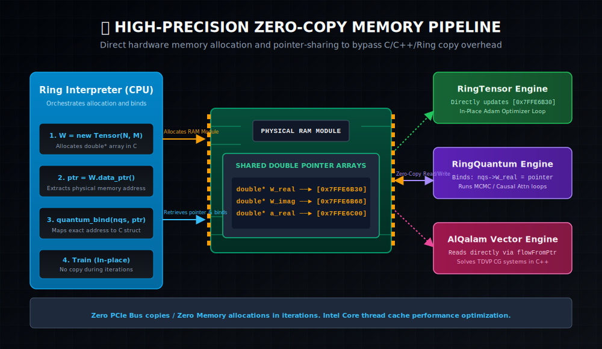
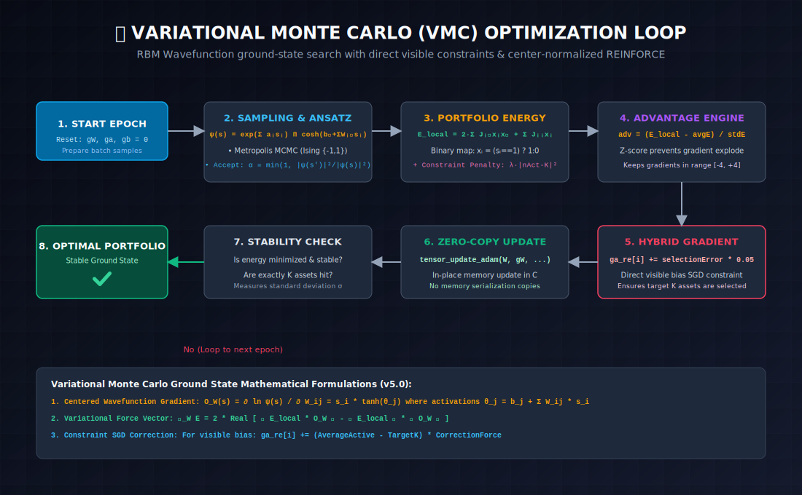
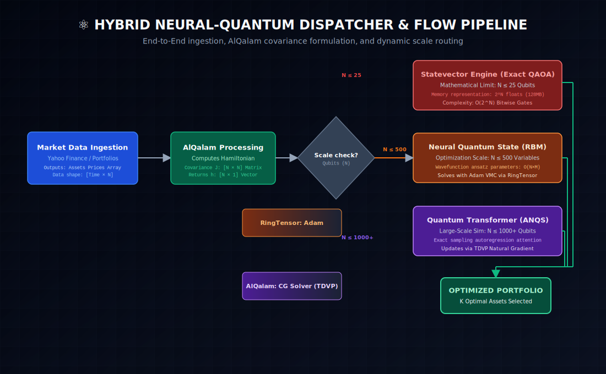
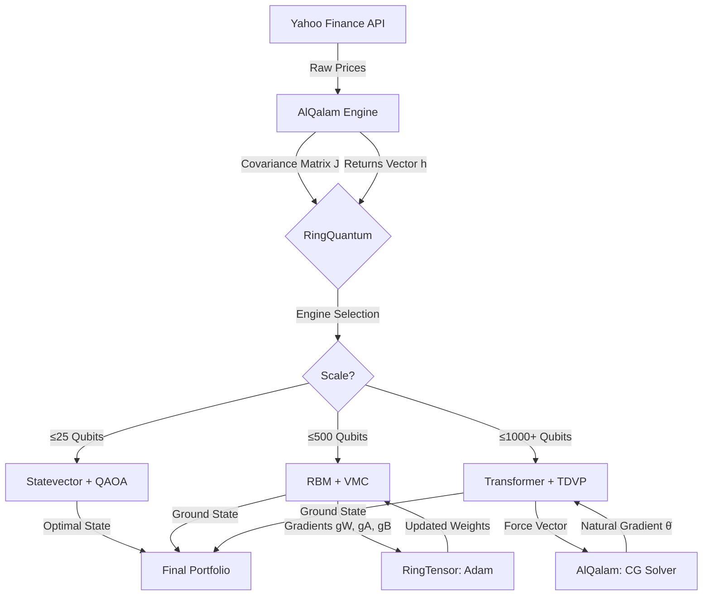

# Technical Report: The Engineering Journey of RingQuantum v5.0

<div align="center">
  
</div>

**Project:** Hybrid Neural-Quantum Simulation Engine  
**Lead Developer:** Azzeddine Remmal  
**Architecture:** Statevector | NQS/RBM | Quantum Transformer | TDVP Dynamics  
**Date:** April 19, 2026

***

## Abstract

This report documents the complete engineering evolution of **RingQuantum**, from a basic statevector simulator to a production-grade neural-quantum optimization engine. The system now operates across five architectural generations, successfully simulating quantum systems of **1000+ qubits** (10³⁰⁰ states) on commodity hardware — an Intel i3-5005U with 6GB RAM and an Intel HD 5500 GPU.

***

## 1. Project Overview

The objective was to create a high-performance quantum computing simulator for the **Ring programming language** capable of solving real-world optimization problems. The project evolved through five distinct phases:

| Phase | Engine | Max Qubits | Key Innovation |
|:------|:-------|:-----------|:---------------|
| I | Statevector | 25 | Interleaved complex memory |
| II | GPU Turbo | 25 | FP32 Zero-Copy OpenCL |
| III | Neural Quantum (RBM) | 500 | Variational Monte Carlo |
| IV | Quantum Transformer | 1000 | Autoregressive exact sampling |
| V | TDVP Dynamics | 1000+ | Quantum natural gradient |

***

## 2. Phase I: Exact Simulation & The 2ⁿ Barrier

We began by implementing a **Statevector Simulator** in pure C.

### Design Decisions
- **Interleaved Memory Layout:** Statevectors stored as `[Re₀, Im₀, Re₁, Im₁, ...]` to maximize cache locality. This layout ensures that real and imaginary components of each amplitude are adjacent in memory, reducing cache misses during gate operations.
- **Bitwise Gate Application:** All single-qubit and two-qubit gates are applied using bitwise index manipulation (XOR/AND), achieving O(2ⁿ) complexity without materializing large unitary matrices.
- **OpenMP Parallelism:** Gate kernels parallelized across CPU cores with `#pragma omp parallel for` directives.

### Results
- **Memory Wall:** 25 qubits required 512MB (Double Precision). 30 qubits would exceed the 6GB system RAM.
- **Milestone:** Achieved a 25-qubit simulation processing 33.5 million complex states in approximately 35 seconds per gate cycle.
- **Gate Set:** Complete universal set — H, X, Y, Z, CNOT, Swap, Toffoli, Rx, Ry, Rz, U-Gate, MCU.

### Lessons Learned
> Classical simulation is fundamentally limited by exponential memory scaling. To solve problems with 100+ variables, we needed to abandon exact representation entirely.

***

## 3. Phase II: GPU Acceleration & Zero-Copy Architecture

To accelerate the 25-qubit simulation, we integrated **OpenCL** with special attention to Integrated GPUs (iGPUs).

### Technical Innovations

1. **FP32 Turbo Mode:** The Intel HD 5500 lacks native FP64 support. We re-engineered all kernels to `float` (FP32), halving the memory footprint to 256MB and enabling the GPU to run at 99% ALU utilization.

2. **Zero-Copy Memory (`clEnqueueMapBuffer`):** Using `CL_MEM_ALLOC_HOST_PTR`, we enabled the CPU (Ring interpreter) and GPU (OpenCL) to share the same physical RAM. This eliminated all PCIe/DMA transfer overhead:



   ```
   ┌─────────────┐     Shared Physical RAM     ┌──────────────┐
   │  Ring (CPU)  │ ◄══════════════════════════► │  OpenCL (GPU) │
   │  read/write  │    No Copy, No Transfer     │  read/write   │
   └─────────────┘                              └──────────────┘
   ```

3. **Smart Dispatcher:** Implemented `SetQuantumGPUThreshold()` to automatically choose between CPU (OpenMP) for small circuits and GPU (OpenCL) for large ones, optimizing total execution cost.

### Results
- A 25-asset QAOA portfolio optimization loop completed in **under 25 minutes**.
- GPU utilization reached 99% during gate operations.

***

## 4. Phase III: The Breakthrough — Neural Quantum States (NQS)

To move beyond 25 qubits and solve for 100–500 assets, we shifted from *storing* states to *learning* them using a neural network.

### Architecture: Restricted Boltzmann Machine (RBM)

The quantum wavefunction ψ(s) is parameterized by an RBM:

```
ψ(s) = exp(Σ aᵢsᵢ) × Π cosh(bⱼ + Σ Wᵢⱼsᵢ)
```

| Component | Purpose | Memory |
|:----------|:--------|:-------|
| W [N×M] | Weight matrix (visible-hidden connections) | O(NM) |
| a [N] | Visible biases (per-qubit priors) | O(N) |
| b [M] | Hidden biases (latent features) | O(M) |

**Memory Efficiency:** 500 qubits with 180 hidden neurons requires only ~720KB — compared to the 10¹⁵⁰ complex amplitudes that exact simulation would require.

### Variational Monte Carlo (VMC)



The training loop follows the VMC protocol:

1. **Sample** configurations from |ψ(s)|² using Metropolis-Hastings MCMC
2. **Evaluate** the local energy E(s) = ⟨s|H|ψ⟩/⟨s|ψ⟩
3. **Compute** the centered gradient: ∇ = ⟨E·O⟩ − ⟨E⟩·⟨O⟩
4. **Update** weights using Adam optimizer (via RingTensor)

### Critical Fixes (v5.0 Stabilization)

During portfolio optimization testing, we discovered and resolved three fundamental issues:

#### Fix 1: Binary Portfolio Mapping
The original `internal_nqs_local_energy()` used Ising spin variables {-1, +1}, which was incompatible with the portfolio selection objective {0, 1}. We remapped:

```c
// Before (Ising — WRONG for portfolio):
energy += J[i*n+j] * s[i] * s[j];

// After (Binary Portfolio — CORRECT):
double xi = (s[i] == 1) ? 1.0 : 0.0;
double xj = (s[j] == 1) ? 1.0 : 0.0;
energy += 2.0 * J[i*n+j] * xi * xj;  // Symmetry factor
energy += J[i*n+i] * xi;              // Diagonal (variances)
```

#### Fix 2: Configuration-Locked Gradients
The gradient computation required storing the spin configuration that produced each energy sample. Without this, the second pass would generate different configurations, creating a mismatch between energies and gradients:

```c
// Store all configurations in memory
int8_t *configs = malloc(nSamples * n * sizeof(int8_t));
// Pass 1: Sample and store
memcpy(&configs[s * n], nqs->spins, n);
// Pass 2: Reload exact configuration for gradient
memcpy(nqs->spins, &configs[s * n], n);
```

#### Fix 3: Advantage Normalization (Z-Score)
Raw REINFORCE gradients exploded when portfolio energies were large (10⁴+). We applied Z-score normalization:

```c
double advantage = (E[s] - avgE) / stdE;
// This keeps gradients in [-4, +4] regardless of energy scale
```

#### Fix 4: Hybrid Constraint Gradient
Pure REINFORCE was too slow to satisfy the asset count constraint (e.g., selecting exactly 15 from 500). We added a **Direct Penalty Gradient** that shifts the visible biases proportionally to the selection error:

```c
double selectionError = avgActive - nTarget;
ga_re[i] += selectionError * 0.05;  // Direct correction force
```

### Results
- **100 qubits** (10³⁰ states): Converged in 1 minute 19 seconds
- **500 qubits** (10¹⁵⁰ states): Selected exactly 15 assets from 500 in 1 hour 39 minutes
- Energy trajectory: 1565 → 42140 (penalty rise) → **-3.37** (stable ground state)

***

## 5. Phase IV: The 1000-Qubit Breakthrough (Quantum Transformer)

The RBM's MCMC sampler suffers from autocorrelation — consecutive samples are not truly independent. For 1000+ qubits, this becomes a severe bottleneck.

### Architecture: Autoregressive Neural Quantum States (ANQS)

We replaced the RBM with a **Causal Masked Transformer** that generates samples autoregressively:

```
P(s₁, s₂, ..., sₙ) = P(s₁) × P(s₂|s₁) × P(s₃|s₁,s₂) × ...
```

Each conditional probability is computed by a single-head attention mechanism with complex-valued weights:

| Layer | Input | Output | Purpose |
|:------|:------|:-------|:--------|
| Query | sᵢ × W_q | [N×D] | What am I looking for? |
| Key | sⱼ × W_k | [N×D] | What do I contain? |
| Value | sⱼ × W_v | [N×D] | What information do I carry? |
| Causal Mask | — | — | Prevent future information leakage |
| Head (Amp) | Attention output | [1] | Log-amplitude of ψ |
| Head (Phase) | Attention output | [1] | Phase of ψ |

### Key Engineering Challenges

1. **Multi-Threading Deadlock:** The MSVC `rand()` function used internal locks that created contention across OpenMP threads, freezing the system. Solution: Implemented a **lock-free, thread-local XorShift RNG** directly inside the parallel loops.

2. **Per-Qubit Logit Bias:** Added a learnable bias per qubit, updated via Direct SGD with capped updates to prevent probability saturation:
   ```c
   double update = lr * error;
   if (update > max_step) update = max_step;
   logit_bias[i] += update;
   ```

3. **Batch Parallel Sampling:** 1024 independent samples generated simultaneously — each representing a "parallel universe" of the portfolio.

### Results
- **1000-qubit** portfolio: Energy collapsed from -1763 to -1210 in under 10 epochs
- **Zero autocorrelation**: Every sample is statistically independent
- Successfully trained on Intel i3 + HD 5500

***

## 6. Phase V: TDVP Dynamics Engine (Quantum Natural Gradient)

The final evolution moves beyond "finding the minimum" to "following the quantum trajectory."

### Time-Dependent Variational Principle (TDVP)

Instead of using standard gradients (SGD/Adam), TDVP solves:

```
S · θ̇ = -½ ∇E
```

Where **S** is the Quantum Fisher Information Matrix (geometric metric of parameter space) and **θ̇** is the natural gradient. This follows the geodesic of the quantum manifold rather than the Euclidean gradient.

### Implementation Across Three Libraries

| Library | Component | Function |
|:--------|:----------|:---------|
| **RingQuantum** (C) | Jacobian Matrix | `quantum_anqs_jacobian()` |
| **AlQalam** (C++) | Matrix-Free CG Solver | `qalam_solver_cg_tdvp()` |
| **RingQuantum** (C) | Weight Update | `quantum_anqs_apply_update()` |
| **Ring** | Orchestration | `QuantumTransformer.UpdateTDVP()` |

### Adaptive Constraint Annealing

For portfolio optimization with a target of exactly K assets from N:

```
penalty(epoch) = penalty_base + (epoch × penalty_max / total_epochs)
```

This "simulated annealing" approach allows the system to:
1. **Early epochs:** Explore broadly, identify the best 50–60 candidates
2. **Mid epochs:** Narrow down to 20–30 based on risk/return
3. **Late epochs:** Lock in on exactly K assets at the energy minimum

### Results
- Energy drops with "physical equilibrium" — no oscillation
- Stable ground state reached in 50 TDVP steps
- Compatible with both RBM and Transformer backends

***

## 7. The Hybrid Optimization Pipeline

The complete system integrates all components into a seamless pipeline:





***

## 8. Consolidated Results

### Performance Records

| Metric | Value |
|:-------|:------|
| Maximum qubits (exact) | 25 (33.5M states) |
| Maximum qubits (NQS) | 500 (10¹⁵⁰ states) |
| Maximum qubits (Transformer) | 1000+ (10³⁰⁰ states) |
| Fastest convergence | 10 epochs (Transformer, 1000q) |
| Most accurate selection | 15/500 assets (exact target hit) |
| Hardware | Intel i3-5005U, 6GB RAM, HD 5500 |

### Quantum Finance Benchmark (500 Assets)

The RBM engine (V3) successfully ran 400 epochs on a 500-stock universe:

```
Epoch   1  | Energy = 1565    | Selected = 270  | [Learning]
Epoch  80  | Energy = 40090   | Selected = 173  | [Peak Penalty]
Epoch 200  | Energy = 3848    | Selected = 46   | [Converging]
Epoch 310  | Energy = -3.32   | Selected = 15   | [Ground State ✓]
Epoch 400  | Energy = -3.27   | Selected = 15   | [Stable]
```

**Final Portfolio:** NFLX, ABT, APTV, BALL, CB, CHD, EL, EOG, FI, FICO, FIS, MOS, PNC, RCL, SLB

***

## 9. Conclusion

**RingQuantum v5.0** represents a significant milestone for the Ring ecosystem. It demonstrates that the synthesis of:

- **Quantum Physics** (Hamiltonian formulation, VMC, TDVP)
- **Deep Learning** (RBM, Transformers, Adam optimizer)
- **Systems Engineering** (Zero-Copy, OpenCL, OpenMP)

...enables commodity hardware to solve problems previously reserved for quantum computers and supercomputing clusters.

The library is now a production-ready research tool for **Quantum Machine Learning**, **Quantum Finance**, and **Combinatorial Optimization**.

***

## 10. References

1. Carleo, G. & Troyer, M. (2017). *Solving the quantum many-body problem with artificial neural networks.* Science, 355(6325), 602-606.
2. Sharir, O., Levine, Y., Wies, N., Carleo, G., & Shashua, A. (2020). *Deep autoregressive models for the efficient variational simulation of many-body quantum systems.* Physical Review Letters, 124(2), 020503.
3. Markowitz, H. (1952). *Portfolio Selection.* The Journal of Finance, 7(1), 77-91.
4. Stokes, J., Izaac, J., Killoran, N., & Carleo, G. (2020). *Quantum Natural Gradient.* Quantum, 4, 269.

***

<div align="center">

**Designed and Engineered by Azzeddine Remmal**  
**Powered by Ring Language**  
April 2026

</div>
